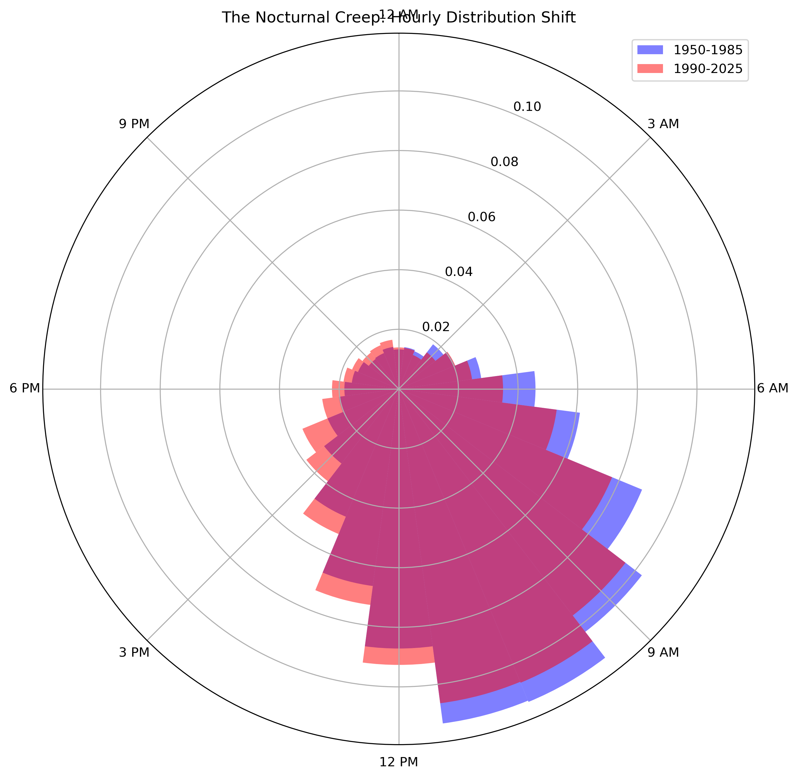
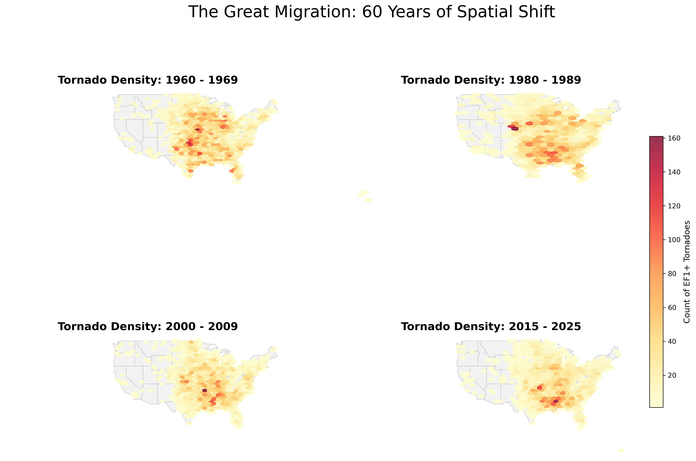
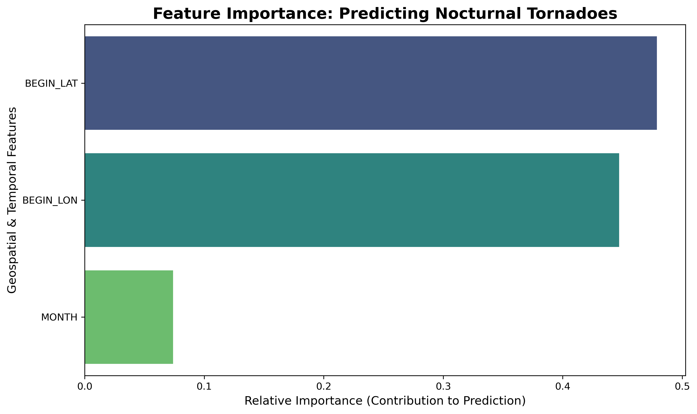

# 🌪️ The Great Migration & The Nocturnal Creep
**A Spatiotemporal Machine Learning Analysis of U.S. Tornado Shifts (1950–2025)**

## 📌 Executive Summary
Over the last 75 years, the behavior of severe weather in the United States has fundamentally changed. This project ingests and analyzes historical NOAA data to investigate two dangerous spatiotemporal phenomena:
1. **The Great Migration:** A geographic shift of tornado density away from the traditional Central Plains (e.g., Oklahoma, Kansas) and into the Southeast (Dixie Alley).
2. **The Nocturnal Creep:** An increasing frequency of nighttime and early-morning touchdowns, which disproportionately impact vulnerable populations.

By engineering local solar time features and deploying a SMOTE-enhanced Random Forest Classifier, this project successfully models the geographic and seasonal parameters driving nocturnal tornado risk.

---

## 🏗️ Data Architecture & Engineering
Processing 75 years of raw, compressed `.csv` files required a high-performance ETL pipeline. 
* **Engine:** DuckDB was utilized to bypass pandas memory constraints, allowing for lightning-fast SQL aggregations across 43,236 distinct EF1+ tornado records.
* **Feature Engineering:** Raw UTC timestamps were converted to **Local Solar Time** using high-precision longitude offsets. This ensured that "Nocturnal" was accurately defined by actual daylight conditions at the specific touchdown location, rather than a flat time zone standard.

---

## 📊 Phase 1: Exploratory Spatial Data Analysis (ESDA)

### 1. The Nocturnal Creep (Temporal Shift)
A comparative analysis of the 1950-1985 baseline versus the modern 1990-2025 era reveals a clear expansion of tornado activity into the late-night and early-morning hours. 

  
   
  <i><b>Figure 1: The Nocturnal Creep.</b> A polar distribution of EF1+ tornadoes by Local Solar Hour. Modern activity (red) shows a distinct expansion into the 9 PM - 9 AM window compared to the 1950-1985 baseline (blue).</i>

### 2. The Great Migration (Geographic Shift)
A non-parametric Mann-Kendall trend test confirmed a statistically significant Eastward shift ($p < 0.001$). 

  
   
  <i><b>Figure 2: The Great Migration.</b> Decadal hexbin density maps. The center of gravity has visibly decoupled from the traditional Plains, establishing a new, highly active centroid in the American Southeast.</i>

---

## 🤖 Phase 2: Predictive Machine Learning

### The Modeling Challenge: The Accuracy Trap
The dataset presented a significant class imbalance: approximately 80% of tornado touchdowns occur during daylight hours. A baseline model would achieve high accuracy simply by predicting "Daytime" for every event, while completely failing to identify the high-risk nocturnal minority class.

### Synthetic Minority Over-sampling Technique (SMOTE)
To ensure the model could effectively identify nocturnal threats, **SMOTE** was utilized to balance the training set. By generating synthetic examples of the minority class, the model was forced to learn the specific spatiotemporal boundaries of nighttime storms rather than just following the majority distribution.

| Metric | Baseline Model (Imbalanced) | SMOTE-Optimized Model |
| :--- | :--- | :--- |
| **Nocturnal Recall** | 24% | **51%** |
| **Accuracy** | 84% | 76% |
| **F1-Score (Nocturnal)** | 0.35 | **0.48** |

> **Strategic Trade-off:** While overall accuracy decreased, **Recall for the nocturnal class doubled**. In disaster forecasting, a False Negative (missing a nighttime storm) is significantly more dangerous than a False Positive.

### Inside the Black Box: Feature Importance

  
   
  <i><b>Figure 3: Gini Feature Importance.</b> Extracted from the SMOTE-trained Random Forest Classifier.</i>

**Key Finding:** `BEGIN_LAT` (Latitude) emerged as the dominant predictor of a nocturnal event. This mathematically validates the physical reality of the threat: lower latitudes (the Southeast/Dixie Alley) have shorter winter days and closer proximity to the Gulf of Mexico's moisture source.

---

## 🚀 Conclusion
This analysis proves that the definition of "Tornado Alley" is no longer static. As activity pushes further South and East, it strikes increasingly under the cover of darkness in areas with higher population densities.

**Repository Structure:**
* `notebooks/`: End-to-end Python pipeline (ETL, EDA, and ML).
* `visual_outputs/`: High-resolution geospatial and temporal visualizations.
* `data/`: Processed DuckDB database.

---

## 🎓 About the Project
This analysis was developed as a capstone portfolio piece for my Master of Science in Data Science (MSDS) journey. It was designed to showcase end-to-end data architecture, spatiotemporal feature engineering, and the deployment of machine learning on imbalanced datasets.
